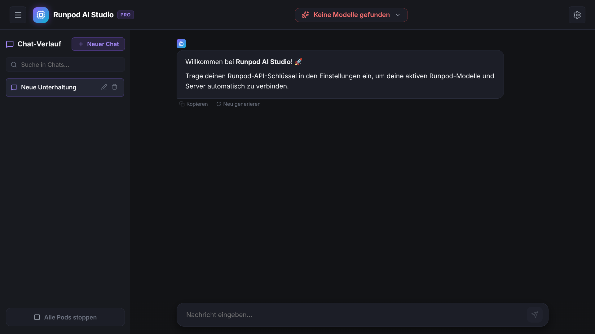

# Runpod AI Studio

<p align="center">
  
</p>

Eine moderne, elegante Chat-Oberfläche im Obsidian-Dark-Design zur direkten Interaktion mit **Large Language Models (LLMs)** auf Runpod – inklusive praktischer Notfall-Stopp-Funktion für aktive Instanzen zur Kostenkontrolle.

Entwickelt für nahtloses Token-Streaming, flexible Modellnutzung (Chat-Modus sowie Completion-Modus für GGUF/Ollama) und schnelles Beenden laufender Pods.

---

## 🌟 Highlights & Funktionen

- **Echtzeit-Streaming:** Schnelle Antworten mit Token-Streaming, Abbruchfunktion (`Stoppen`) und Neu-Generierung.
- **Kostenkontrolle (Notfall-Stopp):**
  - Aktive Pods und Serverless-Endpunkte direkt in der Seitenleiste einsehen.
  - Laufende Instanzen mit einem Klick stoppen, um unbemerkte GPU-Kosten zu vermeiden.
- **Dualer Modus (Chat & Completion):**
  - **Chat-Modus:** Ideal für Instruct-/Chat-Modelle mit dynamischem System-Prompt.
  - **Completion-Modus (Base-Modelle):** Sendet rohen Text ohne Chat-Templates direkt an GGUF-/Base-Modelle (z. B. für Storytelling oder Code-Vervollständigung).
- **100 % Sicher & Privat:**
  - Der Runpod-API-Schlüssel wird **ausschließlich im lokalen Browser-Speicher (`localStorage`)** gespeichert.
  - Keine Speicherung auf Server-Festplatten, keine Weitergabe an Dritte.
- **1-Klick-Start:** Vorkonfigurierte Starter-Skripte für Linux (`./start.sh`) und Windows (`start.bat`).

---

## 🚀 Schnellstart

### 1. Repository klonen
```bash
git clone git@github.com:Qualia-Zero/runpod-ai-studio.git
cd runpod-ai-studio
```

### 2. Anwendung starten

#### Unter Linux:
```bash
chmod +x start.sh
./start.sh
```

#### Unter Windows:
Doppelklick auf `start.bat` oder im Terminal:
```cmd
start.bat
```

*(Das Starter-Skript installiert beim ersten Mal automatisch alle Abhängigkeiten, erstellt den Frontend-Build und öffnet Ihren Browser).*

#### Alternativ manuell über npm:
```bash
npm install
npm run dev
```

Die Anwendung ist anschließend unter **`http://localhost:5173`** erreichbar.

---

## ⚙️ Konfiguration

1. Öffnen Sie die Studio-Einstellungen (Zahnrad-Symbol oben rechts).
2. Tragen Sie Ihren persönlichen **Runpod-API-Schlüssel** ein (`rpd_...` oder `rpa_...`).
3. Passen Sie die Parameter nach Belieben an:
   - **Temperatur:** Kreativität steuern (0.0 = Präzise/Code, 0.7 = Ausgewogen, 1.5+ = Kreativ)
   - **Ausgabe-Tokens:** Maximale Antwortlänge (64 bis 8192 Tokens)
   - **System-Prompt:** Globale Verhaltensanweisungen für das Modell

---

## 🛠️ Verwendete Technologien

- **Frontend:** React 19, Vite, Lucide Icons, React Markdown (GitHub Flavored Markdown)
- **Backend / Proxy:** Node.js, Express, Runpod REST v2 & GraphQL API
- **Design:** Modernes Glassmorphism / Obsidian Dark Theme

---

## 📄 Lizenz

Dieses Projekt ist unter der [MIT-Lizenz](LICENSE) lizenziert.
